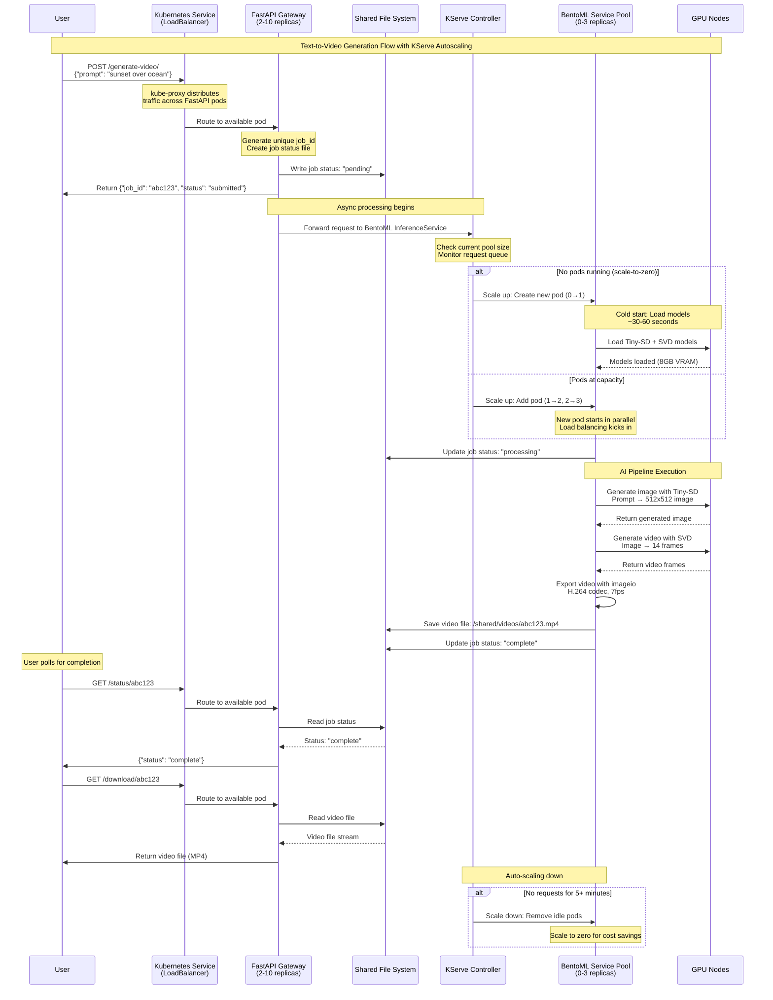

# End-to-End Text-to-Video API on Kubernetes

This project provides all the necessary code and configuration to deploy a scalable text-to-video generation service on Kubernetes using FastAPI, BentoML, and KServe.


**Example prompt**: "A beautiful sunset over calm ocean waves"
**Output**: 14-frame video (2 seconds at 7fps, 512x512 resolution)

> **✨ This video was generated by our text-to-video system using Tiny-SD + Stable Video Diffusion**

## Architecture Overview

The application is composed of two main microservices and a shared storage volume:

- **FastAPI Gateway (fastapi-app)**: A lightweight Python server that acts as the public-facing API. It handles user requests, initiates generation jobs, and serves the final video files. It does not run any AI models.

- **BentoML Inference Service (bento-service)**: A powerful Python service that runs the text-to-video pipeline on a GPU. It uses Stable Diffusion XL (SDXL) for text-to-image and Stable Video Diffusion (SVD) for image-to-video. This service is managed by KServe for serverless autoscaling (including scale-to-zero).

- **PersistentVolume**: A shared network storage volume that is mounted by both services. The BentoML service writes generated videos to the volume, and the FastAPI service reads from it to serve downloads.

### System Flow Diagram



### Key Features

- **🚀 Serverless Autoscaling**: KServe automatically scales BentoML pods from 0-3 based on demand
- **💰 Cost Optimization**: Scale-to-zero saves GPU costs during idle periods
- **⚡ GPU Acceleration**: Optimized for Tesla T4/V100 with memory-efficient models
- **🎯 Production Ready**: Load balancing, health checks, and error handling
- **📊 Memory Optimized**: Uses Tiny-SD (55% smaller) instead of full SDXL model

## Prerequisites

- **Docker **: For building container images.
- **kubectl**: For interacting with your Kubernetes cluster.
- **BentoML**: Install with `pip install bentoml`.
- **Container Registry**: A place to push your images (e.g., Docker Hub, Google Artifact Registry, AWS ECR).
- **Kubernetes Cluster**: With at least one GPU node (e.g., NVIDIA A100, V100, or RTX series).
- **KServe**: Must be installed on your Kubernetes cluster.

## Deployment Steps

### Step 1: Build and Push Container Images

You need to build two Docker images and push them to your container registry.

#### A. Build the BentoML Inference Service

1. Navigate to the `bento_service` directory.

2. Build the Bento:
   ```bash
   bentoml build
   ```

3. Containerize it (replace `your-registry/bento-video-service` with your own image name):
   ```bash
   bentoml containerize text_to_video_generator:latest -t your-registry/bento-video-service:latest
   ```

4. Push the image:
   ```bash
   docker push your-registry/bento-video-service:latest
   ```

#### B. Build the FastAPI Gateway

1. Navigate to the `fastapi_app` directory.

2. Build the image (replace `your-registry/fastapi-video-gateway` with your own image name):
   ```bash
   docker build -t your-registry/fastapi-video-gateway:latest .
   ```

3. Push the image:
   ```bash
   docker push your-registry/fastapi-video-gateway:latest
   ```

### Step 2: Configure and Deploy to Kubernetes

1. **Update Image Names**: In the `kubernetes/02-fastapi-deployment.yaml` and `kubernetes/03-kserve-inferenceservice.yaml` files, replace the placeholder image names with the ones you just pushed.

2. **Apply Manifests**: Apply all Kubernetes configurations. It's best to do this in order:
   ```bash
   kubectl apply -f kubernetes/00-namespace.yaml
   kubectl apply -f kubernetes/01-storage.yaml
   kubectl apply -f kubernetes/02-fastapi-deployment.yaml
   kubectl apply -f kubernetes/03-kserve-inferenceservice.yaml
   ```

### Step 3: Use the API

#### Find the FastAPI Service IP

Get the external IP address for the FastAPI gateway:

```bash
kubectl get svc -n text-to-video-app fastapi-gateway-service
```

Wait for the `EXTERNAL-IP` to be assigned. Let's say it's `34.123.45.67`.

#### Submit a Generation Job

Send a prompt to the `/generate-video` endpoint. This will return a unique `job_id`:

```bash
curl -X POST "http://34.123.45.67/generate-video/" \
  -H "Content-Type: application/json" \
  -d '{"prompt": "A robot painting a masterpiece, cinematic style"}'
```

**Response:**
```json
{"message":"Job submitted successfully.","job_id":"some-unique-uuid"}
```

#### Check Job Status

Poll the `/status/{job_id}` endpoint until the status is "complete":

```bash
curl http://34.123.45.67/status/some-unique-uuid
```

**Response (while processing):**
```json
{"status":"processing"}
```

**Response (when done):**
```json
{"status":"complete"}
```

#### Download the Video

Once complete, you can download the video from the `/download/{job_id}` endpoint:

```bash
curl -o my_video.mp4 http://34.123.45.67/download/some-unique-uuid
```

This will save the generated video as `my_video.mp4` in your current directory.
